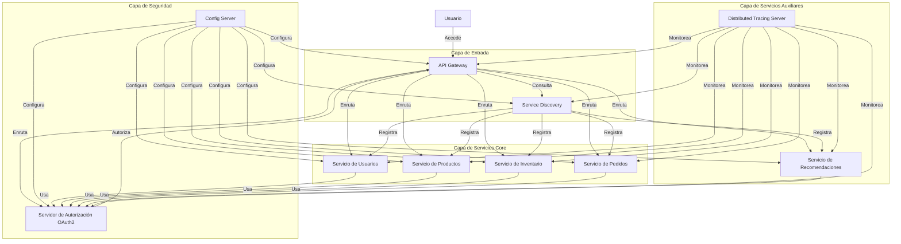
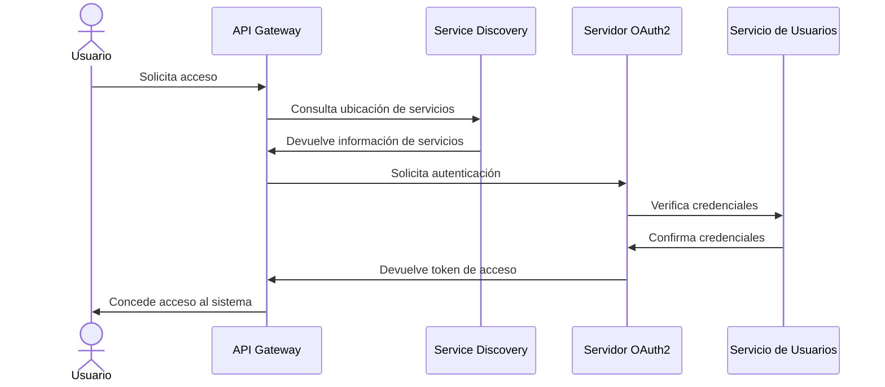
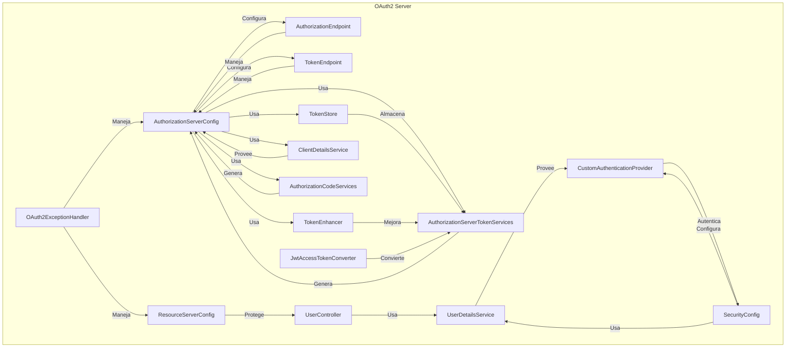

# Arquitectura de Microservicios E-commerce

## Diagrama de Arquitectura

## Diagrama de Secuencia

## Diagrama de componentes

## Componentes del Servidor OAuth2 con Spring Boot
## Configuración y Seguridad
### AuthorizationServerConfig
Configura los endpoints de autorización y token. Este componente es fundamental para establecer cómo se manejarán las solicitudes de autenticación y emisión de tokens. Utiliza varios servicios como TokenStore, TokenEnhancer y ClientDetailsService para personalizar el comportamiento del servidor OAuth2.
### ResourceServerConfig
Protege los recursos de la API, como el UserController. Define qué endpoints requieren autenticación y qué roles o scopes son necesarios para acceder a ellos. Es esencial para asegurar que solo los clientes autorizados puedan acceder a los recursos protegidos.
### SecurityConfig
Configura la seguridad general de la aplicación, incluyendo el proveedor de autenticación personalizado. Aquí se definen aspectos como el manejo de sesiones, reglas de CORS, y la configuración de Spring Security.
## Servicios de Autenticación y Gestión de Usuarios
### UserDetailsService
Proporciona detalles del usuario para la autenticación. Este servicio es crucial para cargar la información del usuario durante el proceso de autenticación, incluyendo roles y permisos.
### CustomAuthenticationProvider
Implementa lógica de autenticación personalizada. Permite definir cómo se validan las credenciales del usuario, lo que puede incluir integración con sistemas externos o lógicas de negocio específicas.
## Gestión de Tokens
### TokenStore
Almacena los tokens generados. Puede ser implementado de diversas formas, como en memoria, en base de datos o utilizando JWT, dependiendo de los requisitos de escalabilidad y seguridad.
### TokenEnhancer
Mejora los tokens con información adicional. Permite añadir claims personalizados a los tokens JWT, enriqueciendo la información que se puede transmitir de forma segura.
### JwtAccessTokenConverter
Convierte entre JWT y objetos de autenticación. Es esencial para la creación y validación de tokens JWT, permitiendo una comunicación stateless entre el cliente y el servidor.
### AuthorizationServerTokenServices
Genera y gestiona tokens. Este servicio coordina la creación, renovación y validación de tokens de acceso y de actualización.
## Endpoints y Controladores
### AuthorizationEndpoint
Maneja las solicitudes de autorización. Es el punto de entrada para los flujos de autorización de OAuth2, como el flujo de código de autorización.
### TokenEndpoint
Maneja las solicitudes de token. Procesa las solicitudes para obtener tokens de acceso, ya sea mediante credenciales de cliente, códigos de autorización o tokens de actualización.
### UserController
Expone endpoints protegidos relacionados con usuarios. Sirve como ejemplo de cómo se pueden proteger recursos específicos de la API utilizando OAuth2.
## Servicios Auxiliares
### ClientDetailsService
Proporciona detalles de los clientes autorizados. Gestiona la información sobre los clientes OAuth2 registrados, incluyendo sus identificadores, secretos y scopes permitidos.
### AuthorizationCodeServices
Genera y valida códigos de autorización. Es crucial para el flujo de código de autorización en OAuth2, asegurando que los códigos sean únicos y de corta duración.
## Manejo de Excepciones
### OAuth2ExceptionHandler
Maneja excepciones específicas de OAuth2. Asegura que los errores relacionados con la autenticación y autorización se manejen de manera adecuada y se devuelvan respuestas apropiadas al cliente.